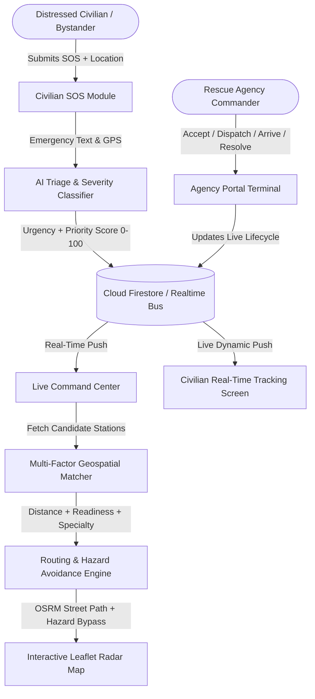

# RALCA  -AI — AI-Powered Rescue Agency Locator & Emergency Coordination Platform

> **"One SOS. One AI. One Fastest Safe Response."**  
>  AI for Everyday Life*

---

## 🚨 Problem Statement

In life-or-death emergencies, traditional 911/108/112 dispatch infrastructure suffers from severe bottlenecks:
1. **Frantic & Ambiguous Distress Signals**: Panicked callers struggle to describe symptoms or trauma accurately under adrenaline.
2. **Slow Manual Triage**: Human dispatch operators must cross-examine callers before categorizing severity.
3. **Siloed Agency Fleets**: Medical ambulances, fire engines, police interceptors, and disaster task forces operate in isolated dispatch databases.
4. **Blind Navigation**: Emergency vehicles are routed onto standard navigation paths that ignore dynamic secondary hazards (flash floods, smoke plumes, collapsed overpasses).
5. **Civilian Anxiety**: Once an emergency call ends, the victim has zero real-time visibility into whether aid is truly coming.

**RESQ-AI** eliminates these friction points by combining **NLP Emergency Triage**, **Geospatial Multi-Factor Agency Matching**, **Hazard-Aware Safe Street Routing**, and **Real-Time Synchronized Dashboards** into a single cohesive network.

---

## 💡 The Solution



When an emergency occurs:
1. **SOS Received**: The civilian presses SOS and types what happened (or selects a quick prompt) and pinpoints their location via GPS or map pin.
2. **AI Triage**: The hybrid AI engine evaluates life-safety signals (`unconscious`, `severe bleeding`, `trapped`, `fire`, `flood`) to produce urgency (`CRITICAL`, `HIGH`, `NORMAL`), priority score (`0-100`), confidence %, and tactical guidance.
3. **Fleet Matching**: The algorithm scores nearby agencies based on distance, station status (`ACTIVE`, `STANDBY`), ready units, and emergency specialization.
4. **Hazard-Aware Routing**: The system calculates the fastest street route using OSRM, checks for active flood/fire/debris hazard polygons, and generates a **Safe Bypass Route** if required.
5. **Live Dispatch & Civilian Peace of Mind**: The command center dispatches the unit; both the agency terminal and civilian tracking screen update in real time with synchronized ETAs and sirens.

---

## ✨ Key Features

- **Civilian SOS Module (`/sos`)**:
  - Intuitive emergency categorization (Medical, Fire, Accident, Flood, Collapse, Threat, Missing).
  - Real-time live AI preview as the user types.
  - Casualty stepper and high-accuracy browser Geolocation / Map-pin picker.
- **AI Triage & Decision Support**:
  - **Layer 1**: Deterministic rule-based NLP classification matrix with zero-crash guarantee.
  - **Layer 2**: Configurable Gemini 1.5 Flash generative AI API integration via `.env`.
- **Live Command Center (`/command-center`)**:
  - Dark-mode tactical dashboard with high-contrast emergency semantic colors.
  - Real-time KPI Ribbon: Active SOS, Critical Incidents, Available Stations, Deployed Units, Avg ETA.
  - Interactive Leaflet map with custom SVG pulsing markers, agency fleet icons, and hazard overlays.
  - Search and instant filtering by priority, status, and category.
  - Transparent AI agency recommendation drawer with explicit score breakdowns.
- **Hazard-Aware Routing Engine**:
  - Live OpenStreetMap routing via project-osrm.org API with street-curve geometry fallback.
  - Mathematical polygon collision detection against simulated flood and fire zones.
  - Compare "Direct/Fastest" vs. "Safest Hazard-Avoidance" route polylines.
- **Agency Terminal (`/agency`)**:
  - Station commander dispatch queue to accept, dispatch (Code 3), mark on-scene, and resolve.
- **Civilian Live Tracking (`/track/:id`)**:
  - Visual 6-step progress stepper, dynamic ETA countdown, assigned agency telephone link, and category-specific safety guidance.
- **60-Second Automated Live Demo Simulator**:
  - One-click scenario runner (Medical Crash, Tower Fire, Flash Flood) that drives the full lifecycle from SOS to resolution in 60 seconds with play, pause, and reset controls.
- **Synthesized Audio Alerts**:
  - In-app dual-tone emergency alarm, dispatch chimes, and resolution celebration using the Web Audio API (no external mp3 files required).
- **Presentation Mode**:
  - Clean distraction-free fullscreen mode designed specifically for hackathon judges and screen recordings.
- **Dual-Mode Backend**:
  - Connects to Google Cloud Firestore when configured, or transparently falls back to an in-memory + BroadcastChannel reactive bus so anyone can clone and demo without setting up a database first!

---

## 🛠️ Technology Stack

| Layer | Technology |
|---|---|
| **Frontend Framework** | React 18, Vite 6 |
| **Styling & Design** | Tailwind CSS 3.4, Lucide React Icons |
| **Geospatial & Maps** | Leaflet 1.9, CartoDB Dark Matter / OpenStreetMap tiles |
| **Routing** | OSRM (Open Source Routing Machine) API + Geodesic Street Fallback |
| **Backend & Sync** | Cloud Firestore + Local Cross-Tab BroadcastChannel Reactive Bus |
| **Artificial Intelligence** | Gemini 1.5 Flash API (Layer 2) + Deterministic NLP Matrix (Layer 1) |
| **Audio Synthesis** | Web Audio API Oscillator & Gain Nodes |
| **Visual Effects** | Canvas Confetti, CSS Pulse & Beacon Keyframes |

---

## 🚀 Quickstart & Installation

### 1. Clone & Install Dependencies
```bash
git clone https://github.com/your-username/resq-ai.git
cd resq-ai
npm install
```

### 2. Configure Environment (Optional)
The application is pre-configured with **Zero-Setup Mode**: it runs out-of-the-box in local reactive mode with realistic demo agencies and incidents even if no environment variables are provided.

To enable live Google Cloud Firestore or Gemini AI, create a `.env` file from the template:
```bash
cp .env.example .env
```
Fill in your credentials:
```env
# Cloud Firestore (Optional)
VITE_FIREBASE_API_KEY=your_firebase_api_key
VITE_FIREBASE_AUTH_DOMAIN=your_project.firebaseapp.com
VITE_FIREBASE_PROJECT_ID=your_project_id
VITE_FIREBASE_STORAGE_BUCKET=your_project.appspot.com
VITE_FIREBASE_MESSAGING_SENDER_ID=your_sender_id
VITE_FIREBASE_APP_ID=your_app_id

# Gemini API Key (Optional)
VITE_GEMINI_API_KEY=your_gemini_api_key
```

### 3. Start Development Server
```bash
npm run dev
```
Open your browser at `http://localhost:3000`.

---

## 🧪 Recommended 3-Minute Hackathon Demonstration Flow

For judges watching a live walkthrough:

1. **Start on the Landing Page (`/`)**:
   - Highlight the live metrics bar and the 4-step emergency lifecycle.
2. **Trigger SOS (`/sos`)**:
   - Click one of the quick chips: *"Road collision between two cars. 2 people injured and one person is unconscious."*
   - Observe the **Live AI Preview** instantly categorize as `Medical Emergency` with `CRITICAL` urgency.
   - Click **TRANSMIT EMERGENCY SOS NOW**.
3. **Observe Civilian Tracking (`/track/:id`)**:
   - Notice the status is `SOS RECEIVED` with live safety tips.
4. **Open Command Center (`/command-center`) in a Second Tab**:
   - Verify the incident appeared **instantly in real time** without refreshing.
   - Inspect the **KPI Ribbon** incrementing.
   - See the pulsing red marker on the **Live Map**.
5. **Inspect AI Agency Match & Routing**:
   - Click on the incident in the queue.
   - Observe the **AI-Optimized Match** recommending the nearest active medical unit with transparent score metrics.
   - Click **DISPATCH AGENCY**.
   - Notice the **Leaflet Map** draw the green safe route line avoiding simulated hazard zones.
6. **Verify Cross-Tab Sync**:
   - Switch back to the Civilian Tracking tab: observe the stepper has progressed to `ASSIGNED` and `DISPATCHED` with calculated ETA and station contact!
7. **One-Click Live Demo**:
   - Back in Command Center, click **START DEMO** in the top ribbon to watch the 60-second automated emergency simulation.

---

## 🛡️ Hackathon Disclaimer

*RALCA is a decision-support prototype created for Hack Devengers 2.0. All hazard zones, agency stations, and casualty events displayed in demo mode are synthetic simulated data. The system is designed to augment and assist emergency coordinators, not replace official certified municipal dispatch networks without formal integration.*
